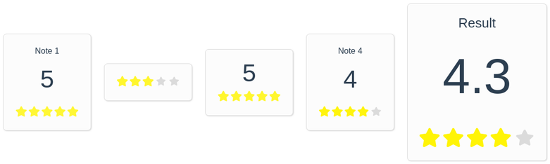
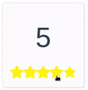
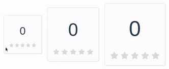

# Star Rate Component

[](https://badge.fury.io/js/star-rate-component)
[](https://badge.fury.io/gh/thalysonrodrigues%2Fstar-rate-component)
[](https://github.com/thalysonrodrigues/star-rate-component/blob/master/LICENSE)

<p align="center">
    <a href="https://github.com/thalysonrodrigues/star-rate-component">
        
    </a>
</p>

> A simple component for VueJS. **Star Rate Component** is a component for [**VueJS**](https://vuejs.org/) for evaluating items through stars with or without punctuation. A customizable component in a simple and intuitive way with a sophisticated and good design.

## Installation

### Download (Zip)

Download this [link](https://github.com/thalysonrodrigues/star-rate-component/archive/v1.0.1.zip).

### Build

Clone this repository

```
$ git clone https://github.com/thalysonrodrigues/star-rate-component.git
```

### NPM

Install the latest version by **npm**

```
$ npm install --save star-rate-component@latest
```

## Get Started

### Basic usage

> **Note:** In your App.vue import

```vue
<template>
  <v-star-rate ref="component"></v-star-rate>
</template>

<script>
import StarRate from 'star-rate-component'

export default {
  name: 'App',
  components: {
    // name of component star rate
    'v-star-rate': StarRate
  }
}
</script>
```


### Get value of rating

> Get a value of component by **$refs** in data: "note"

```vue
<script>
(...)
export default {
  (...)
  methods: {
    show () { console.log(this.$refs.component.note) }
  }
}
</script>
...
```

### Set the size of the component

> In property **size**

```vue
<template>
  <div>
    <v-star-rate ref="component1" size="sm"></v-star-rate>
    <v-star-rate ref="component2" size="md"></v-star-rate>
    <v-star-rate ref="component3" size="lg"></v-star-rate>
  </div>
</template>
```



## Properties

Property | Type | Possible values | Description | Remarks |
---------|------|-----------------|-------------|---------|
```color-box```| String | colors in rgb, rgba or hexadecimal | Color for container box in component | No required, default: ```#fcfcfc``` |
```color-text```| String | colors in rgb, rgba or hexadecimal | Color of pontuation and title | No required |
```default-color-star```| String | colors in rgb, rgba or hexadecimal | Color of star deselected | No required, default: ```#dbdbdb``` |
```borders```| Boolean | ```true``` or ```false``` | Border in container of component (box) | No required, default: ```true``` |
```shine```| Boolean | ```true``` or ```false``` | Flashing stars animation | No required, default: ```false``` |
```display```| String | ```simple```, ```normal``` or ```full``` | Simple container without punctuation and without title. Normal container with punctuation. Container full with punctuation and title | No required, default: ```full``` |
```title-box```| String | Anywhere value | Title in container box component | No required |
```result```| Array | Values type number | An array with number-type values ​​of each star-rate-component component for generating an average in this result container | No required |
```size```| String | ```sm```, ```md``` or ```lg``` | Component container size | No required, default: ```md``` |
```labels```| Object | Anywhere value in keys object | Title labels of each star in the assessment | No required, default: ```{terrible: 'terrible', bad: 'bad', good: 'good', great: 'great', perfect: 'perfect'}``` |

## Credits

- [Thalyson Alexandre Rodrigues de Sousa](https://github.com/thalysonrodrigues)

## License 

[MIT License](https://github.com/thalysonrodrigues/star-rate-component/blob/master/LICENSE) © 2018 Thalyson Rodrigues
